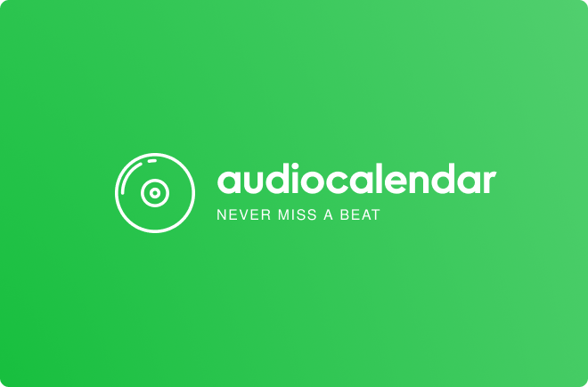

# Audiocalendar

Audiocalendar is a unique application that helps you keep track of the songs you've listened to, seamlessly integrating with Spotify and Google Calendar.

## Table of Contents

- [Features](#features)
- [Project Structure](#project-structure)
- [Installation](#installation)
- [Getting Started](#getting-started)
- [License](#license)

## Features

- **Track Every Song**: Audiocalendar automatically logs every song you listen to on Spotify, so you never have to wonder what that catchy tune was.

- **Discover Your Music DNA**: Gain insights into your listening habits, favorite genres, and artists. Discover your unique music profile and enhance your music experience.

- **Stay Organized**: Easily manage and organize your song history, making every listening session unforgettable.

## Project Structure

This monorepo is organized as follows:

- **client**: The Next.js web app for Audiocalendar.
- **packages**: Shared packages.
- **supabase**: Contains Supabase Edge functions and database migration files.

## Installation

To get started with Audiocalendar, follow these installation steps:

1. Clone this repository:

```bash
git clone https://github.com/szilard-dobai/audiocalendar.git
cd audiocalendar
```

2. Install dependencies:

```bash
pnpm install
```

## Getting Started

To start up the NextJS app, simply run the following command in either the root of the project, or inside `client/`.

```bash
pnpm dev
```

## License

Audiocalendar is released under the [MIT License](LICENSE).
